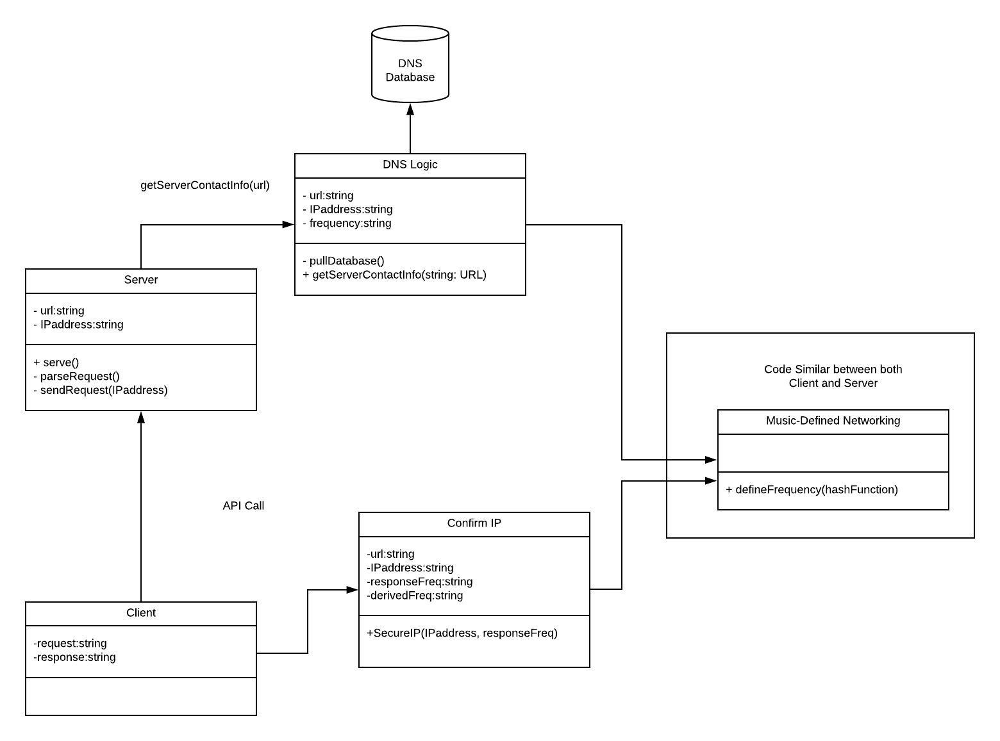

# Usage
Download and install XAMPP https://www.apachefriends.org/index.html  
Run xampp-control and start Apache and mySQL  
Click Admin next to mySQL to open the database page  
Create a database called 'dns' and import dns.sql  
Run server.py and client.py on seperate terminals  

# Project Abstract

### Context
Most web technologies communicate using the HTTP protocol which makes sends requests to URLs which are representations of distant computers. Domain Name Systems (DNS) facilitate these HTTP network connections and requests by translating domain names to more specific or computer readable values. There are four main types of DNS records - A, NS, CNAME, and MX. This project mainly focuses on Type A which resolves a hostname URL to an IP address value since this is one of the most necessary aspects of a DNS server.

### Need
While DNS is the standard for network communication, it is vulnerable to various attacks, such as typosquatting, DDoS attacks, DNS amplification attacks, registrar hacking, and cache poisoning.

### Task
The purpose of this project is to design and build a way to securely connect to DNS. Music-defined networking offers a safer way to make queries and receive responses from DNS servers by using audible or ultrasonic frequencies to make secure connections. The data structures involved in this project are a database of frequencies and, a virtual server and client, and a software package called MDN proto. 
There are three steps for implementing this system: first implement type A functionality of the DNS, encode hostnames and IP addresses with a hash function, and respond to DNS requests with the frequency defined by the hash function along with the IP address so that the client can compare the given frequency to a frequency calculated on the client side using a matching hashing function. We can then test the solution using speakers and microphones.

### Object
This will document the use and effectivity of our new DNS protocol and will show testing and examples of this protocol in limited use.

### Findings
We expect this project to create a client server communication protocol that provides lightweight security to help prevent against the security flaws of the current DNS protocols.

### Meanings
This would mean that clients would not have to worry about malicious spoofing of DNS responses by adding an extra layer of identification in the form of the frequency tested with MDN

### Perspectives
In the future we can create a more robust architecture to deal with the other DNS records. Also there are more options that could be added to create more security by utilizing more of the functionality of MDN proto.

##### Project Architecture

